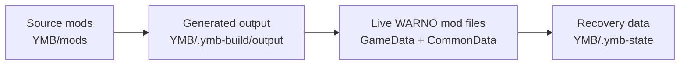

# Yokaiste's Mod Builder (YMB) for WARNO

[](https://store.steampowered.com/app/1611600/)
[](docs/README.md)
[](https://bun.com/)
[](LICENSE)

> Build advanced WARNO mods that withstand game updates. Stop fighting broken code after every patch.

YMB is an advanced source-mod builder for WARNO. Instead of editing live `GameData` and `CommonData` files by hand—and relying on fragile game scripts to merge updates that create endless conflicts—you author structured source mods under `YMB/mods`. YMB applies your targeted patches, runs your generation scripts, and seamlessly materializes the result into the live mod root.

It is built for:

- modders who want their mods to survive game updates without spending hours resolving merge conflicts
- creators who want to use generation scripts, template expressions, and programmatic tools for advanced modifications
- teams who want to build modular projects using safe merges, strict dependency resolution, and conflict safety
- modders who want to delegate work to AI agents, utilizing strict validators and structured logic to ensure error-free development

## Table of Contents

- [Why YMB Exists](#why-ymb-exists)
- [Start Here](#start-here)
- [The Core Model](#the-core-model)
- [Quick Start](#quick-start)
- [What YMB Handles](#what-ymb-handles)
- [Command Map](#command-map)
- [Folder Layout](#folder-layout)
- [Safety Model](#safety-model)
- [Read By Need](#read-by-need)
- [Links](#links)
- [License](#license)

## Why YMB Exists

WARNO modding becomes painful fast when changes are scattered across live files. When Eugen releases an update, running the native game scripts to merge those updates often results in massive conflicts and broken code. You are forced to spend hours hunting down what the script mangled.

YMB solves this by giving your work a resilient, modular shape:

- **Targeted NDF patches** modify the game's logic without overwriting entire files.
- **Safe mod combinations** allow you to break large projects into smaller feature packs with explicit dependencies and safe merges.
- **Generation scripts** and **template expressions** programmatically assemble complex data and resolve cross-mod logic.
- **Source isolation** keeps your authored mods safely isolated under `YMB/mods`.
- **Clean merges** ensure updates to the base game combine flawlessly with your structural patches.
- **AI-Ready structure** forces LLM coding agents to work predictably within strict YAML schemas and validators, allowing you to relax and fully delegate development.

This separation saves you from the nightmare of broken merge scripts and allows you to push the boundaries of what is possible in WARNO modding.

## Start Here

> [!IMPORTANT]
> YMB requires **Bun**. Install it first from [bun.com](https://bun.com/).

If this is your first run, do these in order:

1. Install Bun from [bun.com](https://bun.com/).
2. Open a terminal in the `YMB` folder.
3. Run `bun install`.
4. Run `bun run ymb doctor`.
5. Only then create or build source mods.

> [!TIP]
> If `doctor` points at the wrong WARNO mod root, stop there and fix the folder layout before continuing.

## The Core Model

YMB is easiest to understand as a four-part workflow.



| Stage     | What lives there                                | Why it matters                          |
| --------- | ----------------------------------------------- | --------------------------------------- |
| Source    | `YMB/mods/<your-mod>/config`                    | Your authored truth                     |
| Generated | `YMB/.ymb-build/output`                         | Safe testing and inspection before sync |
| Live      | `<ModRoot>/GameData` and `<ModRoot>/CommonData` | What WARNO actually loads               |
| Recovery  | `YMB/.ymb-state`                                | What lets YMB restore tracked originals |

The one-line rule:

> `build` tests your logic and generates output. `sync --yes` writes it to the game. `recover --yes` undoes it safely.

## Quick Start

### 1. Install dependencies

After installing Bun from [bun.com](https://bun.com/):

```bash
bun install
```

### 2. Verify the builder context

```bash
bun run ymb doctor
```

### 3. Create a new source mod

```bash
bun run ymb init --id my_pack --name "My Pack" --description "My first YMB source mod"
```

### 4. Validate and test it

```bash
bun run ymb validate --mod my_pack
bun run ymb build --mod my_pack
```

Open the generated output here:

```text
YMB/.ymb-build/output/
```

### 5. Publish only after review

```bash
bun run ymb sync --mod my_pack --yes
```

### 6. Recover tracked originals later if needed

```bash
bun run ymb recover --mod my_pack --yes
```

<details>
<summary><strong>What the starter scaffold gives you</strong></summary>

- a source-mod config file
- a sample patch
- a sample replace file
- a sample generation script
- a sample script test
- a local README for the new source mod

</details>

## What YMB Handles

YMB is not just one patch format. It combines multiple authoring styles cleanly:

- ✨ **NDF patching** for focused changes inside existing game files
- 🧩 **Modular dependencies** for combining mods and patches safely with explicit `dependsOn` rules
- 🧠 **Template expressions** (`${...}`) for variable substitution across patches and scripts
- 🧱 **Replace files** for intentional whole-file ownership
- 🛠 **Generation scripts** for derived or assembled outputs
- ✅ **Script tests** that run automatically during validation and builds
- 👀 **Safe output testing** before any live files are modified
- 🧯 **Recovery tracking** for previously synced files
- 🎯 **Selection filters** to quickly narrow scope by mod or patch
- 🤖 **AI-Native validation** with rigid schemas that guide agents to generate correct modifications without hallucinating syntax
- 🔒 **Conflict checks** to prevent collisions, overlapping ownership, and unsafe layering

## Command Map

| Command         | Use it for                                         | Writes files?     |
| --------------- | -------------------------------------------------- | ----------------- |
| `doctor`        | Confirm the builder and live mod paths             | No                |
| `validate`      | Catch config, patch, script, and conflict problems | No                |
| `list`          | See discovered source mods and patches             | No                |
| `explain`       | Understand why patches are included or excluded    | No                |
| `build`         | Test logic and generate output                     | Output dir only   |
| `sync --yes`    | Merge the approved result into the game            | Live files        |
| `recover --yes` | Restore tracked originals                          | Live files        |
| `cleanup`       | Remove normal temp artifacts                       | Builder temp only |
| `init`          | Create a starter source mod scaffold               | Source files      |

Common options:

- `--scope <prod|dev>`
- `--mod <id-or-name>`
- `--patch <id>`
- `--dry-run`
- `--no-cache`
- `--verbose`

For terminal help:

```bash
bun run ymb --help
bun run ymb build --help
bun run ymb sync --help
```

## Folder Layout

YMB must live inside a WARNO mod root:

```text
<ModRoot>/
  CommonData/
  GameData/
  YMB/
    mods/
```

Main working paths:

| Path                    | Purpose                                |
| ----------------------- | -------------------------------------- |
| `YMB/mods`              | Source mods you author                 |
| `YMB/docs`              | Documentation                          |
| `YMB/.ymb-build/output` | Generated output for testing           |
| `YMB/.ymb-state`        | Recovery manifest and original backups |

## Safety and Resilience

> [!NOTE]
> The main value of YMB is making your mods resilient to game updates. However, **resilience requires discipline**. If you use YMB to replace entire files or massive chunks of code, you will face the exact same merge conflicts as before. The magic happens when you use targeted, structural patches.

- `validate` catches mistakes and broken references before they touch the game
- targeted NDF operations (like `add`, `modify`, `copy`) apply cleanly over new game versions
- `build` ensures your advanced generation scripts execute correctly
- `recover` works from saved originals in `YMB/.ymb-state` to roll back changes cleanly
- strict conflict checks prevent different parts of your mod from quietly breaking each other

## Read By Need

- 🗺 Want the docs hub first: [Docs Index](docs/README.md)
- 🚀 New to YMB: [Getting Started](docs/getting-started.md)
- 1️⃣ Want the hand-held path: [Step 1: Setup](docs/step-1-setup.md)
- 2️⃣ Want the scaffold explained: [Step 2: First Source Mod](docs/step-2-first-mod.md)
- 3️⃣ Want the test/sync/recover flow: [Step 3: Test, Sync, and Recover](docs/step-3-review-and-publish.md)
- 🧭 Want the command model: [Workflow Guide](docs/workflow.md)
- ⚙️ Want config structure: [Configuration Reference](docs/configuration.md)
- 🧠 Want template syntax: [Template Expressions Reference](docs/template-expressions.md)
- 🩹 Want patch syntax: [NDF Operations Reference](docs/ndf-operations.md)
- 🔬 Want deeper behavior and edge cases: [Advanced Guide](docs/advanced.md)

## Links

- [YSM](https://github.com/Yokaiste/YSM)
- [YSM Community](https://discord.gg/33Sqn6dTjf)
- [Docs](docs/README.md)
- [Bun runtime](https://bun.com/)
- [WARNO on Steam](https://store.steampowered.com/app/1611600/)

## License

YMB is licensed under a custom source-available license in [LICENSE](LICENSE).

In plain language:

- you may use YMB for its normal intended purpose
- you may build mods with it, including mods for commercial projects
- you may not redistribute YMB itself or share modified versions without explicit written permission
- if you publicly share a mod built using YMB during development, include clear and visible attribution to YMB with a working source link
- exact attribution wording does not matter as long as the attribution is truthful and easy to see
- if you intentionally submit contributions, you confirm you have rights to do so and allow Yokaiste to use and relicense the accepted contribution as part of YMB
- the patent section gives a narrow patent permission for allowed licensed use, and removes that patent permission if someone makes a written patent infringement claim against YMB

See [NOTICE](NOTICE) and [LICENSE](LICENSE) for the full terms.
