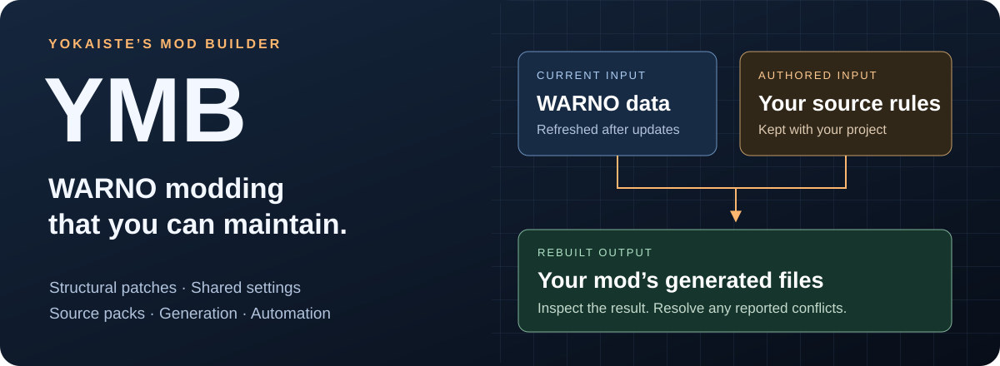

# YMB — Yokaiste’s Mod Builder

### Build ambitious WARNO mods without redoing your work after every game update.

**Structural patches · Modular source packs · Generation tools · AI-ready CLI**

[**Download for Windows**](https://github.com/Yokaiste/YMB/releases/latest) · [**Documentation**](docs/README.md) · [**Community**](https://discord.gg/33Sqn6dTjf)

---

## Keep the changes you meant to make

A balance overhaul can touch hundreds of units across enormous game files. Maintaining copies of those files means tracking both your edits and everything WARNO changes underneath them.

**YMB stores your changes as reusable instructions.** Target a named unit, change a field, or apply one rule to a whole group. The builder reads the game data and produces the finished files, keeping your authored rules separate from generated output.

After a game update, the same instructions can apply to the refreshed data. If a unit disappears or a field moves, YMB identifies the affected patch and location so you can fix that rule. Whole-file replacements are available when needed, but they still need reviewing against updates.

## From one adjustment to an entire overhaul

<table>
<tr>
<td width="50%" valign="top">

### 🎯 Structural NDF patches

Find objects by name, type, or path. Modify fields, add or remove entries, and clone blocks while preserving the surrounding game data. You do not need TypeScript to start.

[See the patch operations →](docs/ndf-operations.md)

</td>
<td width="50%" valign="top">

### 🔁 Rules across a roster

Scale every matching missile’s range, filter a group of units, or repeat an operation for each item in a list. Bulk rules and match limits make large changes manageable.

[Explore bulk changes →](docs/ndf-operations.md#bulk-change-many-blocks-at-once)

</td>
</tr>
<tr>
<td valign="top">

### 🎛️ Shared customization

Reuse values and expressions across patches, scripts, and file templates. Keep local choices in one builder config, with overrides for all mods, one mod, or one feature.

[Customize source packs →](docs/configuration.md#customizing-installed-mods)

</td>
<td valign="top">

### 📁 Assets and file operations

Add, copy, replace, or remove files and directories alongside your patches. Bring interface assets, localisation, and other resources into the same build.

[Explore file operations →](docs/configuration.md)

</td>
</tr>
<tr>
<td valign="top">

### ⚙️ Generation scripts

Generate decks, descriptors, or other content with TypeScript when configuration is not enough. The public API supplies NDF editing, target reads, assertions, and cache tools.

[Explore the script API →](docs/script-tools.md)

</td>
<td valign="top">

### 🧪 Checks built into the workflow

Validate configs and NDF output, run companion script tests, and report independent failures together. A build includes those checks before writing its preview.

[Understand build checks →](docs/workflow.md)

</td>
</tr>
</table>

## Combine features without losing track of their changes

Source packs can keep balance, interface work, and generated content in separate features while sharing one build. Select whole mods or individual patches; dependencies and priorities determine their order.

YMB can combine non-overlapping edits to the same file and supports deliberate layering between mods. When changes collide, it reports the conflict and its contributors. Combining packs still requires compatible changes; ordering alone cannot make every mod compatible.

Features marked optional can drop out when required game data is missing, with the reason reported. Authors can require every feature when checking a release.

[Mod layering and ownership →](docs/advanced.md)

## Built for people, scripts, and AI agents

| Task                     | What the builder provides                                                                    |
| ------------------------ | -------------------------------------------------------------------------------------------- |
| **Understand a project** | Discover mods and patches, explain inclusion decisions, and inspect installed state.         |
| **Locate a change**      | Search NDF blocks by name, type, or field without opening a huge descriptor file.            |
| **Automate a build**     | Versioned JSON with selected ids, output paths, contributors, counts, and structured errors. |
| **Fix a failure**        | Reports identify the file, patch, and operation, with a reason and suggested action.         |
| **Work repeatedly**      | Scoped commands and caches reuse unchanged work; progress reports show the active phase.     |

The same commands serve interactive work and unattended tools. JSON mode stays noninteractive, so an agent can inspect results without parsing terminal decoration or waiting for a prompt.

[Machine interface →](docs/workflow.md#scripting-ymb) · [Large-project performance →](docs/advanced.md#keeping-large-projects-fast)

## Review, apply, and recover

**Build a preview → Apply with sync → Compile using WARNO’s tools**

The preview lets you inspect the output before applying it to your WARNO mod folder. Sync saves originals and tracks the files it changes; recovery restores those originals and removes generated additions.

| Protection                         | What happens                                                                            |
| ---------------------------------- | --------------------------------------------------------------------------------------- |
| **Explicit application**           | Sync and recovery require confirmation through the CLI.                                 |
| **Manual-edit detection**          | Changed tracked files stop a sync until you decide how to handle them.                  |
| **Interrupted-operation recovery** | Pending writes are rolled back before another protected operation proceeds.             |
| **Output boundaries**              | Builder-managed game output is restricted to the mod’s GameData and CommonData folders. |

[Preview, sync, and recovery →](docs/workflow.md)

## Projects built with YMB

| [Yokaiste’s Sandbox Mod](https://github.com/Yokaiste/YSM)                                                  | [WARNO Tactical Overhaul](https://github.com/Yokaiste/WTO)                                                                  |
| ---------------------------------------------------------------------------------------------------------- | --------------------------------------------------------------------------------------------------------------------------- |
| Generated divisions, Unlimited and Balanced rosters, Zombie Horde, special weapons, and interface changes. | A coordinated balance pass across ammunition, missiles, movement, vision, and weapon behavior, including layering over YSM. |

## Get started

The Windows release includes a launcher and a starter-mod generator. The full package includes Bun, so you can begin with configuration before writing any code. You will need a WARNO mod folder created with the game’s tools.

[**Make your first build →**](docs/getting-started.md)

Related project: [**Yuri’s WARNO Toolkit**](https://github.com/dary1337/yuri-warno-toolkit), for restoring decks and combining mods.

## License

Source-available under a custom license — see [LICENSE](LICENSE) and [NOTICE](NOTICE).

**In plain language:**

- ✅ Use YMB for what it is for, including mods you sell
- ✅ Build and publish whatever you like with it
- ✅ Modify your own copy, and modify it to send a contribution back
- ❌ Do not redistribute YMB itself, or modified copies, without written permission
- 📣 If you publish a mod built with YMB, credit YMB visibly with a working link
- 🤝 Contributions you submit may be used and relicensed as part of YMB

> This list is a summary. The [LICENSE](LICENSE) is what actually applies.

**Third-party software.** YMB bundles [commander](https://github.com/tj/commander.js),
[yaml](https://github.com/eemeli/yaml), and [zod](https://github.com/colinhacks/zod), and the
full archive also ships the [Bun](https://bun.sh) runtime. Each stays under its own license,
listed with a link to its terms in `THIRD-PARTY-NOTICES.md` inside every release.

 

**Questions, bugs, or ideas → [Discord](https://discord.gg/33Sqn6dTjf)**

