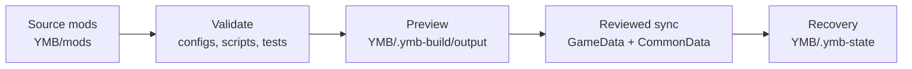

# Yokaiste's Mod Builder (YMB) for WARNO

[](https://store.steampowered.com/app/1611600/)
[](https://github.com/Yokaiste/YMB/releases/latest)
[](docs/README.md)
[](LICENSE)

> Build ambitious WARNO mods without turning every game update into a manual merge project.

YMB is a source-mod builder for WARNO. You describe focused changes, reusable modules, replacements, and generated output under `YMB/mods`; YMB validates the project, builds a reviewable preview, and safely applies the approved result to a generated WARNO mod.

## Why use YMB?

Editing generated WARNO files directly is fast at first but difficult to maintain. Large edits become hard to review, different features collide, and game updates force the same work to be repeated.

YMB keeps authored source separate from generated game files and provides:

- **Update-resilient patches** — change individual NDF objects, fields, and collection entries instead of replacing complete files.
- **Safe previews** — build the complete result under `YMB/.ymb-build/output` before live files change.
- **Modular features** — split a project into source mods and patches with explicit scopes and dependencies.
- **Conflict detection** — reject ambiguous selectors, overlapping ownership, unsafe layering, and invalid generated NDF.
- **Generation scripts** — create complex text or binary output with a supported public API and reusable NDF tools.
- **Automatic script tests** — run companion checks during validation, builds, and syncs.
- **Template expressions** — reuse variables and derive paths or values without copying configuration.
- **Whole-file and asset support** — include files that are intentionally owned in full alongside focused patches.
- **Selective builds** — build one source mod, patch, or development scope while dependencies remain correct.
- **Recovery** — restore original tracked files after a sync.
- **Agent-friendly projects** — strict schemas, focused modules, tests, and structured errors make changes easier to review when working with coding agents.

## How it works



Your source mod remains the authored truth. Preview, cache, and live output can be rebuilt from it; recovery state preserves the originals needed to undo a sync.

## Install

1. Create a WARNO mod with the game's `CreateNewMod.bat` tool.
2. Download the [latest YMB release](https://github.com/Yokaiste/YMB/releases/latest).
3. Extract its `YMB` folder into the created mod, beside `CommonData` and `GameData`.
4. Double-click `YMB/YMB.bat`.
5. Run `doctor` and confirm every path is correct.

```text
<WARNO>/Mods/YourMod/
  CommonData/
  GameData/
  YMB/
    YMB.bat
    docs/
    mods/
```

Only use source mods you trust. Generation scripts run as normal programs during validation and builds.

## First source mod

Open `YMB.bat`, then create a starter project:

```text
init --id my_pack --name "My Pack"
```

YMB creates a small example under `YMB/mods/my_pack` containing a patch, replacement, generation script, and companion test.

```text
mods/my_pack/
  config/
    ymb.mod.yaml
    generate-build-info.ts
    generate-build-info.test.ts
    patch/
      ui/branding/welcome-view/
        ymb.patch.yaml
    replace/
      GameData/
      CommonData/
```

Keep each module responsible for one feature. Prefer focused NDF operations; use replacements only for new assets or files deliberately owned in full.

## Build, review, and sync

```text
doctor
validate --mod my_pack
build --mod my_pack
sync --mod my_pack --yes
```

1. `doctor` verifies the builder and WARNO paths.
2. `validate` checks configuration, selectors, dependencies, scripts, tests, generated NDF, and conflicts.
3. `build` writes a preview without modifying live WARNO files.
4. You inspect `YMB/.ymb-build/output`.
5. `sync --yes` applies the approved result and saves tracked originals.

Restore those originals later with:

```text
recover --mod my_pack --yes
```

Do not delete `YMB/.ymb-state` while recovery may still be needed.

## Authoring options

### Focused NDF operations

Use declarative `copy`, `modify`, `add`, and `remove` operations for exact changes inside existing NDF files:

```yaml
targets:
  - file: GameData/Generated/Gameplay/Units.ndf
    operations:
      - op: modify
        selector:
          kind: field
          by: path
          value: Descriptor_Unit_T80U.FrontArmor
        value: 7
```

Selectors use names, paths, types, field matches, or indexes. YMB requires exact safe matches and verifies the resulting NDF.

For one rule that must update many related blocks, `bulk` can filter blocks by name, type, text, or field content and then set or multiply fields and MAP entries or edit lists. Match and change expectations make broad rules fail safely when WARNO data changes.

### Generation scripts

Use scripts when output depends on several inputs or needs programmatic generation. Scripts can read selected targets, emit text or binary files, update owned authored state, validate NDF, manage generated blocks, and cache disposable derived analysis through the public `ymb/api` interface.

Companion tests belong beside the scripts they protect and run automatically in the normal workflow.

### Replace files

Files under `config/replace` are copied to matching `GameData` or `CommonData` paths. This is useful for new assets, localization, or complete files owned by the source mod. Focused patches remain safer for existing game files.

### Variables and templates

`${...}` expressions work in paths, operation values, replacements, and script configuration. They support source-mod and patch variables, built-in project values, operators, arrays, member access, and helpers for common generated data.

### Dependencies and scopes

Source mods and patches can declare dependencies. YMB adds required dependencies, orders them before dependents, and fails when a dependency is missing or disabled.

Use `scope: prod` for normal output and `scope: dev` for optional development patches. Selecting development scope includes both.

## Commands

| Command         | Purpose                                                     |
| --------------- | ----------------------------------------------------------- |
| `doctor`        | Verify YMB, WARNO, preview, and recovery paths              |
| `init`          | Create a starter source mod                                 |
| `list`          | List discovered source mods and patches                     |
| `explain`       | Explain selection, scope, and dependency decisions          |
| `validate`      | Check configuration, patches, scripts, tests, and conflicts |
| `build`         | Write a preview without changing live files                 |
| `sync --yes`    | Apply the selected build to the WARNO mod                   |
| `recover --yes` | Restore tracked originals                                   |
| `cleanup`       | Remove disposable output while preserving recovery data     |

Common filters and diagnostics:

```text
build --mod my_pack
build --patch gameplay.armor
build --scope dev
build --dry-run
validate --no-cache --verbose
```

Run `help` or `<command> --help` for the current command reference.

## Safety model

- Live files are not changed by `validate`, `build`, or `--dry-run`.
- Generated paths must remain under `GameData` or `CommonData`.
- NDF is validated before and after patching.
- Selection and dependency conflicts fail before sync.
- Tracked live edits are checked before they are replaced.
- Sync and recovery use rollback protection for interrupted operations.
- Normal cleanup preserves recovery data.
- Scripts and downloaded source mods must still be reviewed and trusted.

## Documentation

- [Getting started without coding](docs/getting-started.md)
- [Workflow and safety](docs/workflow.md)
- [Configuration](docs/configuration.md)
- [NDF operations](docs/ndf-operations.md)
- [Generation scripts](docs/script-tools.md)
- [Template expressions](docs/template-expressions.md)
- [Advanced usage](docs/advanced.md)

## License

YMB is licensed under a custom source-available license in [LICENSE](LICENSE).

In plain language:

- you may use YMB for its normal intended purpose
- you may build mods with it, including mods for commercial projects
- you may not redistribute YMB itself or share modified versions without explicit written permission
- if you publicly share a mod built using YMB during development, include clear and visible attribution to YMB with a working source link
- exact attribution wording does not matter as long as the attribution is truthful and easy to see
- if you intentionally submit contributions, you confirm you have rights to do so and allow Yokaiste to use and relicense the accepted contribution as part of YMB
- the patent section gives a narrow patent permission for allowed licensed use, and removes that patent permission if someone makes a written patent infringement claim against YMB

See [NOTICE](NOTICE) and [LICENSE](LICENSE) for the full terms.
