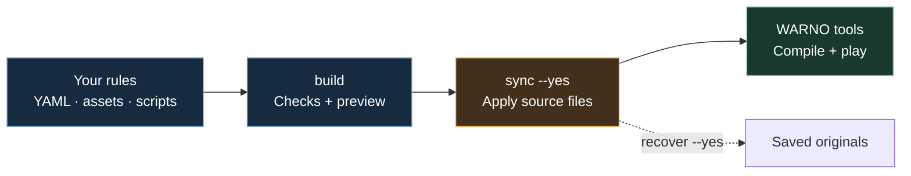

# YMB documentation

**Author patches, configure source packs, and maintain your builds.**

[← Project showcase](../README.md) · [First build](getting-started.md) · [Customize a mod](configuration.md#customizing-installed-mods) · [Automation](workflow.md#scripting-ymb)

---

## What would you like to do?

| 🎮 Start here                                                     | 🎛️ Make it yours                                                            | 🔧 Build something bigger                                          |
| ----------------------------------------------------------------- | --------------------------------------------------------------------------- | ------------------------------------------------------------------ |
| [Install and make a first change](getting-started.md)             | [Tune an installed source mod](configuration.md#customizing-installed-mods) | [Write a generation script](script-tools.md)                       |
| [Understand preview, sync, and recovery](workflow.md)             | [Change a value in NDF](ndf-operations.md#modify-change-a-value)            | [Layer two source mods](advanced.md#layering-one-mod-over-another) |
| [Read and fix an error](getting-started.md#when-something-breaks) | [Reuse settings with variables](template-expressions.md)                    | [Use YMB from a script or AI agent](workflow.md#scripting-ymb)     |

## Follow the result

A **source mod** is the set of changes you author. A **preview** is the finished set of files you inspect. **Sync** applies those files to your WARNO mod folder; WARNO’s tools compile them for the game.

> [!TIP]
> A build already includes validation and script tests. Run `validate` separately when you want checks without writing a preview.

## Know where your files live

| Folder               | What belongs there                                                                     |
| -------------------- | -------------------------------------------------------------------------------------- |
| `mods/<pack>/config` | Your source rules and assets. Edit these, or use local overrides in `ymb.config.yaml`. |
| `.ymb-build`         | Disposable previews and caches. A rebuild replaces preview edits.                      |
| `.ymb-state`         | Saved originals used by recovery. Keep this until you no longer need to undo a sync.   |

## Reference shelf

[Configuration](configuration.md) · [NDF operations](ndf-operations.md) · [Expressions](template-expressions.md) · [Script API](script-tools.md) · [Advanced topics](advanced.md)

For contributors: [Development principles](development.md)
