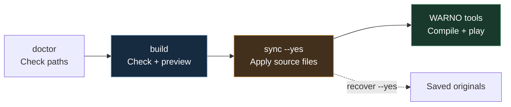

# How a Build Works

[← Docs](README.md) / Workflow

**Check the folders → preview → apply → compile.** A build includes validation; you do not need to run the same checks twice.



> [!NOTE]
> Preview and validation leave game-mod data unchanged. Scripts may update their source data and caches. Sync and recovery write game-mod files.

## Choose the command you need

### 1. `doctor` — am I pointed at the right place, and what is installed?

Prints every folder YMB will read from and write to. If a path looks wrong, stop here;
nothing else will make sense until it is right.

It also reports the state of what you have already installed:

| Line                 | Means                                                             |
| -------------------- | ----------------------------------------------------------------- |
| `installed`          | How many files are synced, and which mods own them.               |
| `changed since sync` | A synced file holds content YMB cannot account for.               |
| `back to original`   | A synced file is back at its untouched game bytes.                |
| `missing backup`     | A tracked original is gone, so `recover` cannot restore that one. |
| `bun`                | The runtime in use, and whether it satisfies this build.          |

`changed since sync` is the one to read carefully: it stops the next `sync` until you
either preserve the edits or run `sync --yes --reset-changed`. `back to original` needs
nothing from you — that is usually `GenerateMod.bat` or a WARNO update rewriting a file
it owns, and the next `sync` applies over it again. **Run `doctor` first when something
refuses to sync** — it names the files before anything else does.

### 2. `validate` — is anything broken?

Reads your configs, applies your patches in memory, runs your script tests, and checks
the NDF syntax of the combined output. It leaves the game and preview unchanged.
Generators may update their owned source files and caches.

### 3. `build` — show me the finished files

Produces exactly what would be installed, in a folder you can open:

```text
YMB/.ymb-build/output
```

Open it. Read the files you changed. This is your review step.

When a patch removes live files, the preview includes `.ymb-deletions.json` with the
exact sorted paths. No live file is removed until `sync --yes`.

### 4. `sync --yes` — install it

Rebuilds from the current source, applies files and deletions to `GameData` and `CommonData`,
and saves untouched originals under `YMB/.ymb-state`. If you edit settings after a preview,
sync uses those new settings. Keep the same mod and patch filters you reviewed.

`--yes` confirms the write. After sync, compile the mod with WARNO’s generation tools before loading it in game.

## Undo a sync

```text
recover --yes
```

Puts the original files back and removes files YMB created.

> **Keep `YMB/.ymb-state`.** That folder is the undo history. Deleting it means
> `recover` can no longer restore anything.

Recover only part of a build:

```text
recover --mod my_pack --yes
recover --patch ui.branding --yes
```

## Working on part of a project

| Option            | What it does                                                                  | Available on                          |
| ----------------- | ----------------------------------------------------------------------------- | ------------------------------------- |
| `--mod <id>`      | Only this mod. Repeat for several.                                            | every command except `init`           |
| `--patch <id>`    | Only this patch. Repeat for several.                                          | every command except `init`           |
| `--scope dev`     | Include development patches as well as normal ones.                           | every command except `init`           |
| `--verbose`       | List every line, not only the ones worth acting on.                           | every command except `init`           |
| `--no-cache`      | Redo all work instead of reusing cached results.                              | `validate`, `build`, `sync`           |
| `--require-all`   | Hold optional patches to the same standard as the rest.                       | `validate`, `build`, `sync`           |
| `--dry-run`       | Leave game and preview files unchanged; scripts may update owned source data. | `build`, `sync`, `recover`, `cleanup` |
| `--yes`           | Confirm a command that changes files.                                         | `sync`, `recover`, `cleanup --all`    |
| `--reset-changed` | Put the saved original back over any tracked file that changed outside YMB.   | `sync`, `recover`                     |
| `--ymb-path <p>`  | Work on a YMB folder other than the one you are in.                           | every command, including `init`       |
| `--json`          | Print one JSON result instead of readable text.                               | every command, including `init`       |

```text
validate --mod my_pack
build --patch ui.branding
build --scope dev --verbose
```

`--mod` and `--patch` match an id or a display name exactly, so a near miss selects nothing
rather than something smaller. When a value matches nothing, the command says so and names
what it did find. It is a warning, not a failure: one command line reused across installs
may legitimately name a mod that is not on all of them.

`init` takes none of the selection filters — it creates a mod rather than selecting one.
It accepts `--id`, `--name`, `--description`, `--ymb-path`, and `--json`.

Anything your selection depends on is added automatically. A missing or disabled
dependency stops the build with an error naming it.

## Reading the progress line

The first time you run a command with a given selection, YMB has nothing to go on, so it
measures instead of guessing. There is no estimate on that run — only what is actually
known, which is how long it has been going:

```text
YMB build  [====>.........]  28%  12.30s
```

It remembers how long each step took. From the next run of that same command and
selection the bar is weighted by those measurements, so it spends its time where the work
is, and the estimate is a real one:

```text
YMB build  [=========>....]  61%  19.80s  eta 12s
```

If a run turns out slower or faster than the one before it — a busy machine, or a cache
that now answers most of the work — the estimate moves to match while the run is still
going, however large the difference.

Terminals that cannot redraw a line get one line per finished step instead, plus the
elapsed time and estimate while a long step is still running.

A different command, a different selection, `--no-cache`, and a first build into an empty
cache are all different amounts of work, so each measures itself once before it can
estimate. Only runs that finish are recorded; a run you interrupt or that fails partway
never becomes the estimate for the next one. The measurements live under `.ymb-build` and
are safe to delete — the next run measures again.

## Scripting YMB

Use `--json` for scripts and AI agents. Each invocation writes one compact JSON document
on stdout, with no banner, progress animation, or interactive questions. Read the process
exit code and `ok` first: `0` means success, `1` means failure.

```text
ymb --help --json
ymb build --help --json
ymb list --json
ymb find --name Example --file GameData/Units.ndf --limit 20 --json
ymb build --mod my_pack --json
```

### Read fields, not terminal text

| Field                             | Use it for                                                                            |
| --------------------------------- | ------------------------------------------------------------------------------------- |
| `schemaVersion`                   | JSON contract version, currently `1`. The application version is separately in `ymb`. |
| `command`, `ok`                   | Identify the result and whether it succeeded.                                         |
| `selection`                       | Requested scope, mods, patches, cache settings, and dry-run state.                    |
| `data`                            | Command-specific records with numbers, booleans, ids, and paths.                      |
| `errors`                          | Failed inputs with categories, paths, source locations, and suggested fixes.          |
| `errorCount`, `omittedErrorCount` | Total failures and the number omitted when the collection limit is reached.           |

| Command         | Useful fields under `data`                                                            |
| --------------- | ------------------------------------------------------------------------------------- |
| `list`          | `mods` with ids, names, enabled state, config paths, and patches                      |
| `explain`       | `patches` with inclusion state and reasons                                            |
| `find`          | `matches`, `matchCount`, `searchedFiles`, `limit`, `truncated`                        |
| `doctor`        | `paths`, `runtime`, and `health` with changed targets and missing backups             |
| `validate`      | Selected `mods`/`patches`, numeric `counts`, `notices`, `cache`                       |
| `build`, `sync` | Selected ids, `files` with contributors, `deletions`, `counts`, `notices`, `findings` |
| `recover`       | Numeric `counts` and `findings`                                                       |
| `cleanup`       | `targets`, `preserved`, `counts`, `includeRecovery`                                   |
| `init`          | Created mod `id`, `name`, `path`, and `files`                                         |
| `--help`        | Command names and options, including accepted values and defaults                     |

`summary`, `details`, `locations`, and `nextSteps` remain available for existing
integrations and display. Their wording is for people; use `data` for decisions.
Unknown additive fields can be ignored. Use error categories, ids, and paths rather
than matching an English sentence. NDF syntax errors also include a stable `code`,
1-based `line` and `column`, and a 0-based `offset` (UTF-16 code units). These locate
the problem in the NDF content, separately from `operationLine` in a YAML patch.
`sourcePath`, when present, points to the authored replacement or generator to edit.

> [!IMPORTANT]
> `find` respects `--limit` in JSON too. Check `data.truncated` and narrow the query
> or raise the limit. `--verbose` does not remove that search limit.

An unattended starter command needs `--name` and preferably `--id`. JSON mode reports
missing input as an error instead of opening a prompt. Writes still require `--yes`.

```powershell
$result = & .\YMB.bat build --mod my_pack --json | ConvertFrom-Json
if ($LASTEXITCODE -ne 0 -or -not $result.ok) {
    $result.errors | Select-Object code, path, line, column, reason, suggestion
    exit 1
}
$result.data.files | Select-Object path, sourceType
```

## Other commands

| Command               | Use it to                                                       |
| --------------------- | --------------------------------------------------------------- |
| `list`                | See the mods and patches YMB found.                             |
| `explain`             | Find out why a patch was skipped.                               |
| `find`                | Search the game files for a block, to write a selector for it.  |
| `init`                | Create a starter mod to learn from.                             |
| `cleanup`             | Delete previews and caches. Keeps your undo data.               |
| `cleanup --all --yes` | Also delete the undo data. Only when you are done with the mod. |

## After a WARNO update

A game update replaces the files your patches change, so put the originals back first:

```text
recover --yes
```

Update the WARNO mod with the game's own tools, then:

```text
doctor
build
```

Features marked [`optional`](configuration.md#optional-features-built-on-game-data-that-may-not-be-there)
drop out on their own when the game data they were built on is gone, and the run says which
ones. Add `--require-all` when you want to see those as failures instead.

If a selector no longer matches, `validate` names the patch and the target. It keeps going
after the first problem and reports **every** independent one it found — numbered, each
with its own reason, fix, file, mod, and patch — so a game update that moved several files
is one round of edits rather than one run per file. Focused patches usually survive
updates; whole-file replacements usually do not.

An update can also make a patch redundant rather than broken — it ships the value the patch
was setting, or retires the block it was deleting. That is not a failure, so the run
finishes and counts a `warning` for each one, naming the `ymb.patch.yaml` line to open.
Those are the operations you can now delete. See
[when the game already says it](ndf-operations.md#when-the-game-already-says-it) for the
full list, and for why a patch you have already synced never triggers one.

## When something goes wrong

### An NDF syntax error

YMB checks the combined NDF output before replacing preview or live files. This
includes patches, replacements and generated files, whether a script returns text
or bytes. Cached output passes the same check.

The error shows **where it broke**, a short excerpt with a caret, and **how to fix it**.
For example, an object placed after its list closes needs to move inside the list:

```ndf
// Broken: Child() is outside the Children list.
Root is Container(Children = [] Child())

// Fixed
Root is Container(Children = [Child()])
```

| Reported problem           | What to check                                                                                  |
| -------------------------- | ---------------------------------------------------------------------------------------------- |
| Expected an assignment     | Use `Member = Value` or `Name is Type(...)`; check that an object is inside its intended list. |
| Expected a value           | Check for an empty assignment or an unfinished expression, such as `Value = 2 +`.              |
| Expected a comma           | Separate list entries with commas. One trailing comma is fine; two in a row are not.           |
| Unclosed string or comment | Close the quote or `/* ... */` comment at the reported location.                               |

For generated content, the line number describes the output being checked. Use the
excerpt and listed contributor to find its source patch or generator, correct that
source, and build again. A failed syntax check keeps the previous preview and live
files in place; generators may already have updated their owned source files.

> [!NOTE]
> Syntax checks do not know every internal WARNO type, resource or gameplay rule.
> After a successful sync, still compile with WARNO's tools and test the mod in game.

### Other problems

Work through [if you are stuck](getting-started.md#if-you-are-stuck), then fix your
**source mod** and build again — never the preview, which is regenerated every build.

If YMB reports that it rolled back an interrupted operation, your files were restored to
their previous state. Read the listed files, then run the command again.
