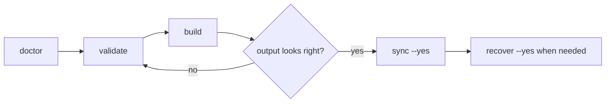

# Workflow Guide

This is the day-to-day operating manual for YMB.

If `Getting Started` teaches the first run, this guide teaches the rhythm you come back to every time you work on a mod.

## 🧭 The Short Version

> [!IMPORTANT]
> Treat YMB like this:
>
> - `doctor` = trust the context
> - `validate` = catch mistakes early
> - `build` = generate output and test logic
> - `sync --yes` = merge the reviewed result into the game
> - `recover --yes` = roll tracked files back

That model, combined with targeted patching, is the reason your mods will survive game updates.

## 🧠 The Core Loop



Recommended command order:

```bash
bun run ymb doctor
bun run ymb validate
bun run ymb build
bun run ymb sync --yes
```

Useful side tools:

```bash
bun run ymb list
bun run ymb explain --scope dev
bun run ymb build --dry-run
```

## 📍 The Places That Matter

| Place                                           | What it is                            | When you care                      |
| ----------------------------------------------- | ------------------------------------- | ---------------------------------- |
| `YMB/mods`                                      | Your authored source mods             | Always                             |
| `YMB/.ymb-build/output`                         | Generated output from `build`         | Before every sync                  |
| `<ModRoot>/GameData` and `<ModRoot>/CommonData` | Live files used by WARNO              | After `sync`                       |
| `YMB/.ymb-state`                                | Recovery manifest and saved originals | During rollback or recovery checks |

## 🚀 Recommended Flow

### 1. `doctor`

```bash
bun run ymb doctor
```

Use `doctor` before trusting anything else. It confirms the builder root, live mod root, output root, and recovery root.

Use it when:

- you just moved the project
- you are working in a new WARNO mod root
- something feels wrong before validation even starts

### 2. `validate`

```bash
bun run ymb validate
```

`validate` checks the current selection without writing preview or live game files. It may update caches, and trusted generation scripts can deliberately update source-owned files through context write helpers.

It catches things like:

- layout and path problems
- config schema errors
- dependency and selection issues
- script test failures
- unsafe targets
- replace ownership conflicts
- NDF parse and patch failures
- tracked-file integrity issues from previous sync runs

> [!TIP]
> If something is missing or unexpectedly selected, `explain` is often the right next command, not `sync`.

### 3. `build`

```bash
bun run ymb build
bun run ymb build --dry-run
```

`build` resolves the current selection and writes generated output under:

```text
YMB/.ymb-build/output/
```

Use it when:

- validation is clean
- you want to inspect the materialized result
- you want to test logic before merging into the live game

Use `build --dry-run` when you want the plan without writing generated preview files. It still executes trusted scripts and may update caches or source-owned files.

### 4. `sync`

```bash
bun run ymb sync --yes
```

`sync` merges the approved result into the live mod root.

Important behavior:

- `--yes` is required because live files are being updated
- unchanged outputs are skipped
- supported text targets receive YMB markers
- original content is backed up into `YMB/.ymb-state`

> [!WARNING]
> Do not treat `sync` as the first inspection step. That is what `build` is for.

### 5. `recover`

```bash
bun run ymb recover --yes
```

`recover` restores tracked originals from the recovery state.

Important behavior:

- `--yes` is required unless you use `--dry-run`
- `--mod` and `--patch` filters still apply
- files created by sync may be deleted during recovery if there was no original version
- missing backups are treated as real recovery errors

## 🧰 Supporting Commands

### `list`

```bash
bun run ymb list
```

Use `list` when you want a quick inventory of the source mods and patches YMB can currently see.

### `explain`

```bash
bun run ymb explain --scope dev
```

Use `explain` when the active selection surprises you.

It answers questions like:

- why is this patch included?
- why is this patch excluded?
- did `--scope`, `--mod`, or `--patch` filter it out?
- did a dependency pull it back in?

### `cleanup`

```bash
bun run ymb cleanup
bun run ymb cleanup --all --yes
```

Use `cleanup` to remove normal builder temp artifacts.

Use `cleanup --all --yes` only when you intentionally want to remove recovery state and all-only temp artifacts too.

## 🎛 Filters and Switches

| Option               | Meaning                                         |
| -------------------- | ----------------------------------------------- |
| `--ymb-path <path>`  | Run against a specific `YMB` directory          |
| `--scope <prod       | dev>`                                           | Choose which scopes are eligible |
| `--mod <id-or-name>` | Select an exact source mod id or exact mod name |
| `--patch <id>`       | Select an exact patch id                        |
| `--dry-run`          | Skip normal preview/live/recovery writes        |
| `--no-cache`         | Bypass patch-output and script-test caches      |
| `--verbose`          | Print more detail                               |

Only relevant commands expose each option. `--dry-run` is not a sandbox: trusted scripts still run as normal code and can write through the source-text helpers.

## 🎯 Selection Rules

Selection happens in layers.

### Scope

- `--scope prod` includes only patches with `scope: prod`
- `--scope dev` includes both `prod` and `dev`

### Filters

- `--mod <id-or-name>` filters source mods by exact id or exact name
- `--patch <id>` filters patches by exact patch id

### Dependencies

Dependencies are resolved after the initial filter pass.

That means a required source mod or patch can still enter the final plan even if you did not mention it directly in the command.

## 🧪 Practical Examples

Validate a specific builder path:

```bash
bun run ymb validate --ymb-path D:\SteamLibrary\steamapps\common\WARNO\Mods\MyMod\YMB
```

Test one source mod only:

```bash
bun run ymb build --mod my_pack
```

Inspect a narrow plan without writing output files:

```bash
bun run ymb build --mod my_pack --patch ui.branding.welcome_view --dry-run
```

Sync one mod after testing:

```bash
bun run ymb sync --yes --mod my_pack
```

Recover one mod later:

```bash
bun run ymb recover --yes --mod my_pack
```

## 🩺 Troubleshooting Order

If the result is not what you expected, check in this order:

1. `doctor`
2. `list`
3. `explain`
4. `validate`
5. `build --dry-run`

That sequence usually tells you whether the problem is pathing, discovery, selection, validation, or final materialization.
